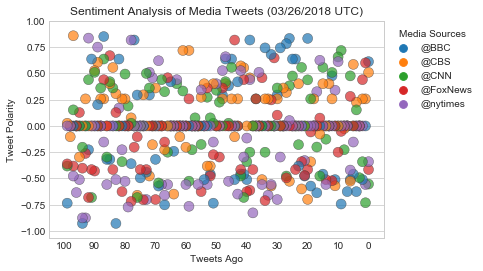
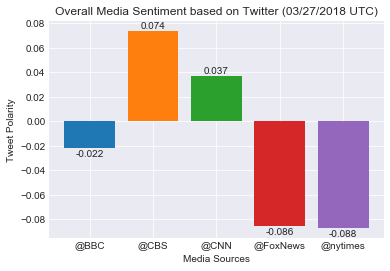

# Twitter Sentiment Analysis of Various News Sources

This project analyzed tweets by __BBC, CBS, CNN, Fox, and The New York Times__ using the [VADER Sentiment Analysis](https://github.com/cjhutto/vaderSentiment) tool. The last 100 tweets were pulled from each source from 03/27/2018. 

##### Sentiment Analsis of Tweets over Time


##### Overall Sentiment Analysis by News Source


#### Observed Trends

1. Of the sample data pulled, the news sources seemed to have an overall neutral sentiment. This can be seen by the congregation of points at 0 on the scatter plot. It is also seen by the mean compound sentiments all being within +-.09

2. @FoxNews and @nytimes did see the lowest average compound scores (although still relatively neutral)

3. @CBS saw the highest average compound scores (although still relatively neutral)


#### Jupyter Notebook Markdown
```python
# Dependencies
import pandas as pd
import numpy as np
import matplotlib.pyplot as plt
import json
import tweepy
import seaborn as sns

# Twitter API Keys
from config import consumer_key, consumer_secret, access_token, access_token_secret
```


```python
# Initialize Sentiment Analyzer
from vaderSentiment.vaderSentiment import SentimentIntensityAnalyzer
analyzer = SentimentIntensityAnalyzer()


# Setup Tweepy API Authentication
auth = tweepy.OAuthHandler(consumer_key, consumer_secret)
auth.set_access_token(access_token, access_token_secret)
api = tweepy.API(auth, parser=tweepy.parsers.JSONParser())
```


```python
#List of users to be analyzed
target_users = ["@BBC","@CBS", "@CNN", "@FoxNews", "@nytimes"]

#initiate output lists
compound = []
pos = []
neu = []
neg = []
user = []
tweets_ago = []
date = []


#loop through target_users, and analyze sentiments
for item in target_users:
    
    #initiate counter
    i = 1
    
    #pull last 100 tweets from the user selected
    public_tweets = api.search(item, count=100, result_type = "recent")
    
    #sentiment analysis on 100 tweets
    for tweet in public_tweets["statuses"]:
        
        compound.append(analyzer.polarity_scores(tweet["text"])["compound"])
        pos.append(analyzer.polarity_scores(tweet["text"])["pos"])
        neg.append(analyzer.polarity_scores(tweet["text"])["neg"])
        neu.append(analyzer.polarity_scores(tweet["text"])["neu"])
        user.append(item)
        tweets_ago.append(i)
        date.append(tweet["created_at"])
        

        i = i + 1

print("Analysis Finished")
```

    Analysis Finished
    


```python
sentiments = pd.DataFrame({"Media Sources": user,
                          "Date": date,
                          "Tweet Polarity": compound,
                          "Positive": pos,
                          "Negative": neg,
                          "Neutral": neu,
                          "Tweets Ago": tweets_ago})

sentiments=sentiments[["Media Sources","Tweet Polarity","Positive","Negative","Neutral","Tweets Ago","Date"]]

sentiments.head()
```


<div>
<table border="1" class="dataframe">
  <thead>
    <tr style="text-align: right;">
      <th></th>
      <th>Media Sources</th>
      <th>Tweet Polarity</th>
      <th>Positive</th>
      <th>Negative</th>
      <th>Neutral</th>
      <th>Tweets Ago</th>
      <th>Date</th>
    </tr>
  </thead>
  <tbody>
    <tr>
      <th>0</th>
      <td>@BBC</td>
      <td>0.6124</td>
      <td>0.182</td>
      <td>0.000</td>
      <td>0.818</td>
      <td>1</td>
      <td>Tue Mar 27 02:26:14 +0000 2018</td>
    </tr>
    <tr>
      <th>1</th>
      <td>@BBC</td>
      <td>0.0000</td>
      <td>0.000</td>
      <td>0.000</td>
      <td>1.000</td>
      <td>2</td>
      <td>Tue Mar 27 02:25:27 +0000 2018</td>
    </tr>
    <tr>
      <th>2</th>
      <td>@BBC</td>
      <td>-0.5106</td>
      <td>0.000</td>
      <td>0.148</td>
      <td>0.852</td>
      <td>3</td>
      <td>Tue Mar 27 02:24:57 +0000 2018</td>
    </tr>
    <tr>
      <th>3</th>
      <td>@BBC</td>
      <td>0.0000</td>
      <td>0.000</td>
      <td>0.000</td>
      <td>1.000</td>
      <td>4</td>
      <td>Tue Mar 27 02:24:45 +0000 2018</td>
    </tr>
    <tr>
      <th>4</th>
      <td>@BBC</td>
      <td>-0.6249</td>
      <td>0.000</td>
      <td>0.242</td>
      <td>0.758</td>
      <td>5</td>
      <td>Tue Mar 27 02:24:42 +0000 2018</td>
    </tr>
  </tbody>
</table>
</div>


```python
#export data in the DataFrame into a CSV file
sentiments.to_csv(path_or_buf="sentiments.csv")
```


```python
#Create a scatter plot showing sentiment analysis by media sources
sns.set_style("whitegrid")

plot = sns.stripplot(x=sentiments["Tweets Ago"], y=sentiments["Tweet Polarity"], hue=sentiments["Media Sources"],
           size=10,edgecolor="gray", linewidth = .5, alpha=".7")

plt.legend(title = "Media Sources", bbox_to_anchor=(1,1))
plt.title("Sentiment Analysis of Media Tweets (03/26/2018 UTC)")

plt.xticks(np.arange(0,101,step=10),np.arange(0,101,step=10))
plt.xlim(105,-5)

plt.show()
plt.savefig("scatter.png")
```


```python
grouping = sentiments.groupby("Media Sources").mean()

grouping = grouping.reset_index()

grouping = grouping.drop(["Positive","Negative","Neutral","Tweets Ago"],axis=1)

grouping
```


<div>
<table border="1" class="dataframe">
  <thead>
    <tr style="text-align: right;">
      <th></th>
      <th>Media Sources</th>
      <th>Tweet Polarity</th>
    </tr>
  </thead>
  <tbody>
    <tr>
      <th>0</th>
      <td>@BBC</td>
      <td>-0.021636</td>
    </tr>
    <tr>
      <th>1</th>
      <td>@CBS</td>
      <td>0.073810</td>
    </tr>
    <tr>
      <th>2</th>
      <td>@CNN</td>
      <td>0.036826</td>
    </tr>
    <tr>
      <th>3</th>
      <td>@FoxNews</td>
      <td>-0.085965</td>
    </tr>
    <tr>
      <th>4</th>
      <td>@nytimes</td>
      <td>-0.087544</td>
    </tr>
  </tbody>
</table>
</div>


```python
#Create a bar plot to show the overall sentiments
#of the last 100 tweets of each organization

sns.set_style("darkgrid")

plt.bar(grouping["Media Sources"], grouping["Tweet Polarity"],color=sns.color_palette())

for index,i in enumerate(grouping["Tweet Polarity"]):
    if i < 0:
        plt.annotate(round(i,3),xy=(index,i-.007),ha="center")
    else:
        plt.annotate(round(i,3),xy=(index,i+.002),ha="center")

plt.xlabel("Media Sources")
plt.ylabel("Tweet Polarity")
plt.title("Overall Media Sentiment based on Twitter (03/27/2018 UTC)")
plt.show()

plt.savefig("bar.png")
```


```python
variance = sentiments.groupby("Media Sources").var()

variance = variance.drop(["Tweets Ago"],axis=1)

variance
```


<div>
<table border="1" class="dataframe">
  <thead>
    <tr style="text-align: right;">
      <th></th>
      <th>Tweet Polarity</th>
      <th>Positive</th>
      <th>Negative</th>
      <th>Neutral</th>
    </tr>
    <tr>
      <th>Media Sources</th>
      <th></th>
      <th></th>
      <th></th>
      <th></th>
    </tr>
  </thead>
  <tbody>
    <tr>
      <th>@BBC</th>
      <td>0.194284</td>
      <td>0.012837</td>
      <td>0.009142</td>
      <td>0.018791</td>
    </tr>
    <tr>
      <th>@CBS</th>
      <td>0.105887</td>
      <td>0.006269</td>
      <td>0.010673</td>
      <td>0.012970</td>
    </tr>
    <tr>
      <th>@CNN</th>
      <td>0.109342</td>
      <td>0.007920</td>
      <td>0.008880</td>
      <td>0.017206</td>
    </tr>
    <tr>
      <th>@FoxNews</th>
      <td>0.107561</td>
      <td>0.010557</td>
      <td>0.009402</td>
      <td>0.022669</td>
    </tr>
    <tr>
      <th>@nytimes</th>
      <td>0.163092</td>
      <td>0.013003</td>
      <td>0.014673</td>
      <td>0.024003</td>
    </tr>
  </tbody>
</table>
</div>


